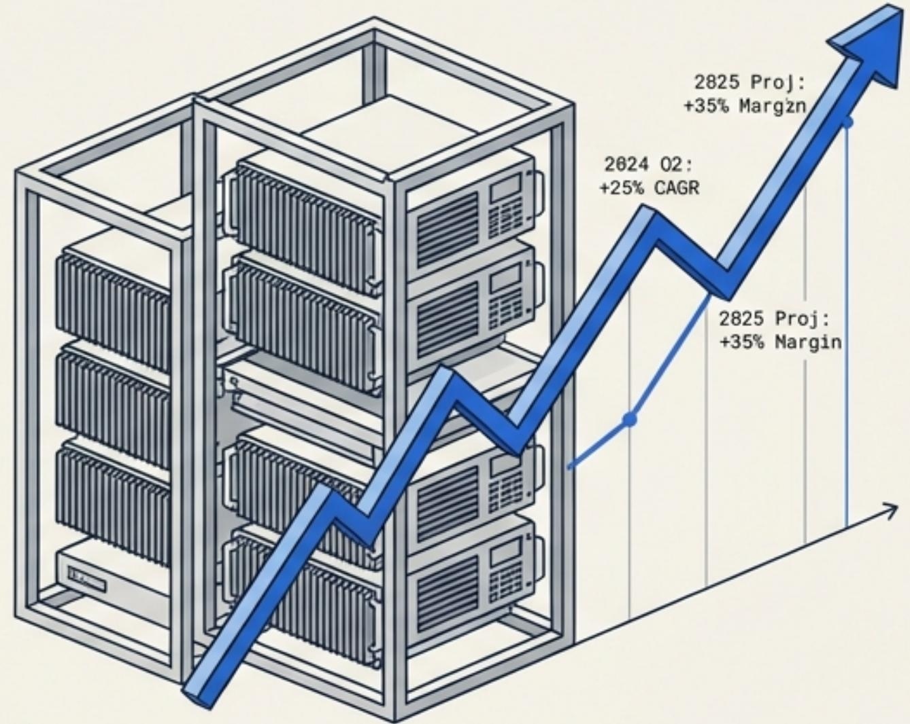
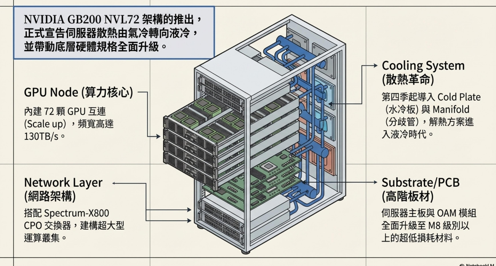
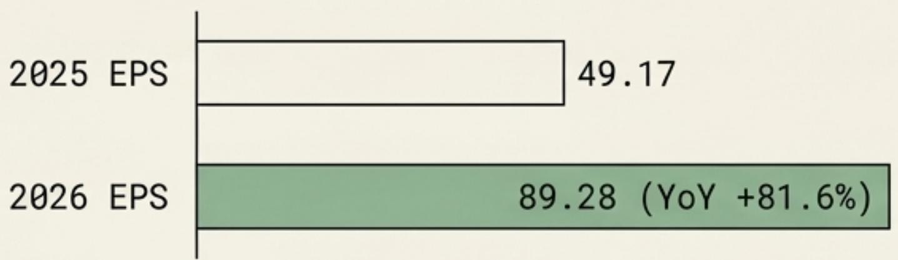
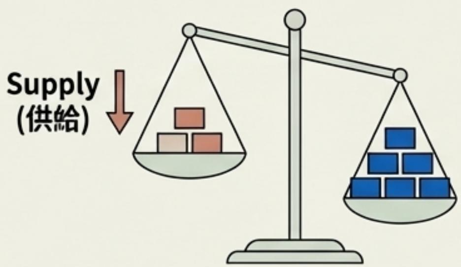
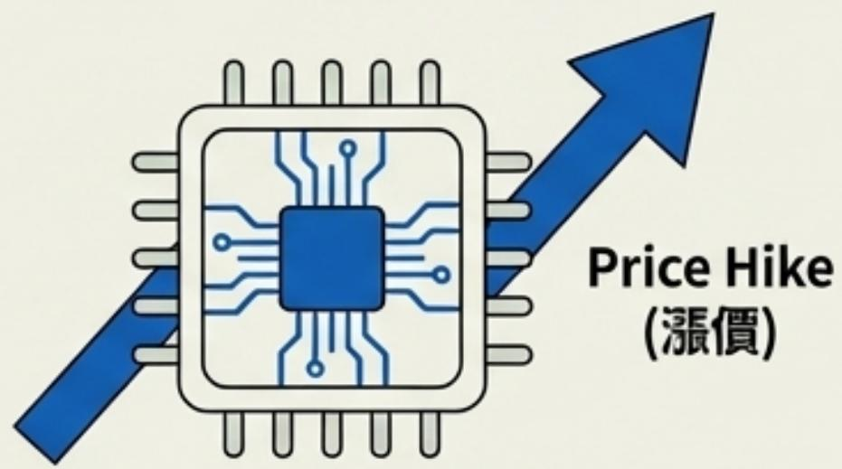
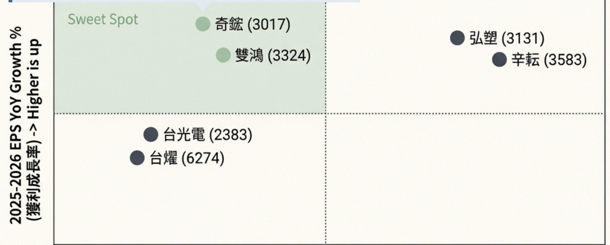

Insight Callout

核心見解：人工智慧基礙設施的快逮擴張，正驅動半導體與資料中心供應鏈的長期重估。2024-2025年，聚焦於具備定價權與開技術讚城河的領先企業，為獲取起越市場回報的核心策略。

2024-2025科技與  
半導體僚供應鏈  
最新市場狀況與投資標的  
排名

聚焦AI基礎設施大躍進與供應鏈定價權的法人級核心選股策略

<table><tr><td>企业名稱（Ticker）</td><td>核心技术優势</td><td>警收成预测（YoY）</td><td>EPS能</td><td>法人按评级</td></tr><tr><td>台嶺電 （2330.TW）</td><td>光港程银尊</td><td>+22%</td><td>強勁</td><td>買入</td></tr><tr><td>辉（NVDA.US)</td><td>AI GPU塑断</td><td>+85%</td><td>極強</td><td>強力買入</td></tr><tr><td>财霖科 （2454.TW)</td><td>线AI整台</td><td>+15%</td><td>定</td><td>持有</td></tr><tr><td>台稍電 (2330.TW)</td><td>先维製程领域</td><td>+23%</td><td>強</td><td>買入</td></tr><tr><td>寰辉蓬 (NVDA.US)</td><td>AI GPU塑断</td><td>+75%</td><td>極強</td><td>買入</td></tr><tr><td>聯科（2454.TW）</td><td>逸AI壁合</td><td>+15%</td><td>稳定</td><td>持有</td></tr></table>

2024-2025年台股科技板塊的核心驅動力，來自於AI基礎設施的典範轉移與供應鏈產能緊缺的雙重疊加。

#

市場現況-AI典範轉移

NVIDIA GTC 2024碓立GB200 NVL72成為次代標準，算力暴增百倍，直接引爆液冷散熱(LiquidCooling)與高階先進封装(CoWoS/SOIC)需求。

# 供應鏈現實-全面漲價與緊缺

產能排擠與上游減産發酵，從記憶體(NAND Flash)\`被動元件(Murata)到功率半導體，全面迎來賣方市場與報價雙位數調漲。

# 投資策略-鎖定超額報酬

屏棄單一題材炒作，聚焦於具備「強勢定價權」且「2026年預估EPS $\mathrm { Y o Y } > 4 0 \%$ 的產業龍頭，構建防禦與爆發具兼具的投資組合。

先進封裝產能排擠與國際大廠減產/調漲報價正沿著供應鏈引發連鎖性的「供需緊俏」效應

先進封装瓶頸 記憶體緊缺 被動元件調漲 功率半導體漲價(TSMC) (Kioxia/Micron) (Murata) (On Semi/Nexperia)台積電CoWoS/SOIC 原廠大幅減產 日系大廠針對積層 大廠調高報價並調產能供不應求，交 SLC/MLC NAND 多層陶瓷電容、 整產能，驅動客戶期延長至6個季度 Flash，導致市場供 RF電感調漲報價 重啟拉貨，結束長，帶動本土設備商 給減少 $2 0 - 3 0 \%$ ， $20 \%$ ，台廠迎來轉 達一年半的庫存調(如辛耘、弘塑) 報價逐季墊高。 單與比價空間。 整期。訂單滿載。

綜合宏觀變局與微觀供應鏈調查，2024-2025年的超額報酬將高度集中於三大核心投資主題

# AI基礎設施升級

聚焦受惠於GB200架構轉換的液冷散熱雙雄與高階銅箔基板獨家供應商。

# 先進封装超級循環

鎖定直接受惠台積電CoWoS/SOIC資本支出擴張的濕製程設備與檢測分析龍頭。

# 供需反轉與定價權

佈局因原廠減產或漲價，具備低價庫存優勢與轉單效應的記憶體模組與電子零組件廠。

# 透過嚴格的量化數據與質化題材交叉比對，我們從龐大的供應鏈中淬鍊出最具爆發力的投資標的。

# 核心主题契合度

企業營收必須高度暴露於液冷散熱、先進封装或關健零組件漲俱三大主軸

# 2026年獲利爆發力

嚴格篩選2025-2026年預估 EPS具備高度成長斜率 $( \mathsf { Y o Y } > 3 0 \mathsf { - } 4 0 \% )$ 的高能見度個股。

# 近期法說與供應鍵確認

排除純概念股，鎖定近期财報亮眼·獲大廠認證(如NVL72供應商)或接獲急單的實質受惠者。

Top10法人级核心選股

2024-2025法人級十大核心投資標的：兼具主題純度與2026年極致獲利成長動能。  

<table><tr><td rowspan=4 colspan=1>排名</td><td></td><td></td><td></td><td></td><td></td></tr><tr><td rowspan=3 colspan=1>企業</td><td></td><td></td><td></td><td></td></tr><tr><td></td><td></td><td></td><td rowspan=2 colspan=1>關鍵催化劑</td></tr><tr><td rowspan=1 colspan=1>核心主題</td><td rowspan=1 colspan=1>2025预估EPS</td><td rowspan=1 colspan=1>2026预估EPS</td></tr><tr><td rowspan=1 colspan=1>1</td><td rowspan=1 colspan=1>奇 (3017)</td><td rowspan=1 colspan=1>液冷龍頭</td><td rowspan=1 colspan=1>49.17</td><td rowspan=1 colspan=1>89.28</td><td rowspan=1 colspan=1>NVL72水冷板主力供應商</td></tr><tr><td rowspan=1 colspan=1>2</td><td rowspan=1 colspan=1>雙鴻 (3324)</td><td rowspan=1 colspan=1>液冷雙雄</td><td rowspan=1 colspan=1>28.20</td><td rowspan=1 colspan=1>52.09</td><td rowspan=1 colspan=1>分歧管與水冷板切入美系雲端</td></tr><tr><td rowspan=1 colspan=1>3</td><td rowspan=1 colspan=1>弘塑 (3131)</td><td rowspan=1 colspan=1>先進封装設備</td><td rowspan=1 colspan=1>70.0~80.0</td><td rowspan=1 colspan=1>135.00</td><td rowspan=1 colspan=1>CoWoS濕製程設備獨家/主力</td></tr><tr><td rowspan=1 colspan=1>4</td><td rowspan=1 colspan=1>台光電 (2383)</td><td rowspan=1 colspan=1>高階CCL獨家</td><td rowspan=1 colspan=1>41.67</td><td rowspan=1 colspan=1>72.66</td><td rowspan=1 colspan=1>M8/M9板材獨占優势</td></tr><tr><td rowspan=1 colspan=1>5</td><td rowspan=1 colspan=1>中砂(1560)</td><td rowspan=1 colspan=1>先進製程耗材</td><td rowspan=1 colspan=1>9.28</td><td rowspan=1 colspan=1>12.27</td><td rowspan=1 colspan=1>鑽石碟受惠2nm與HBM擴產</td></tr><tr><td rowspan=1 colspan=1>6</td><td rowspan=1 colspan=1>辛耘 (3583)</td><td rowspan=1 colspan=1>先進封装設</td><td rowspan=1 colspan=1>15.0~19.0</td><td rowspan=1 colspan=1>47.50</td><td rowspan=1 colspan=1>設備交機潮帶動營收翻倍</td></tr><tr><td rowspan=1 colspan=1>7</td><td rowspan=1 colspan=1>台燿 (6274)</td><td rowspan=1 colspan=1>高階CCL升級</td><td rowspan=1 colspan=1>12.23</td><td rowspan=1 colspan=1>21.33</td><td rowspan=1 colspan=1>800G交换器與M8材料放量</td></tr><tr><td rowspan=1 colspan=1>8</td><td rowspan=1 colspan=1>閎康 (3587)</td><td rowspan=1 colspan=1>先進製程檢測</td><td rowspan=1 colspan=1>12.86</td><td rowspan=1 colspan=1>17.85</td><td rowspan=1 colspan=1>日本晶圖代工與先進封装MA需求</td></tr><tr><td rowspan=1 colspan=1>9</td><td rowspan=1 colspan=1>臻鼎-KY (4958)</td><td rowspan=1 colspan=1>PCB全方位</td><td rowspan=1 colspan=1>6.97</td><td rowspan=1 colspan=1>10.31</td><td rowspan=1 colspan=1>AI伺服器主板與ABF載板發酵</td></tr><tr><td rowspan=1 colspan=1>10</td><td rowspan=1 colspan=1>威剛（3260)/南亚科（2408)</td><td rowspan=1 colspan=1>記憶體反轉</td><td rowspan=1 colspan=1>大幅成長</td><td rowspan=1 colspan=1>趨勢向上</td><td rowspan=1 colspan=1>NAND減產受惠與低價庫存利益</td></tr></table>

深入解析一（液冷散熱） ：NVIDIA GB20O帶動散熱規格質變，奇鉉與雙鴻憑藉技術壁壘形成寡占優勢。

# 奇(3017)[產能領跑者]

關鍵催化劑：

身為兩大Cold Plate供應商之一，首波搭載於美系伺服器代工廠。3DVC出貨強勁，越南廠擴充水冷模組產能，液冷專案市佔率極高

# 雙鴻 (3324)[技術先行者]

<table><tr><td rowspan="4">2025 EPS 2026 EPS</td><td></td></tr><tr><td>28.20</td></tr><tr><td></td></tr><tr><td>52.09 (YoY +84.7%)</td></tr><tr><td></td><td></td></tr></table>

關缝催化劑：

Cold Plate與Manifold切入美系雲端服務商。伺服器液冷散熱零件良率攀升，in-roWCDU透過客戶認證切入第三家美系雲端服務商

結論：兩者皆具備超過 $8 0 \%$ 的2026年獲利爆發力，為AI基礎設施板塊的絕對核心配置。

深入解析二（先進封装）：台積電CoWoS/SOIC產能的爆發性攘建，直接轉 弘塑 (3131)化為本土設備與耗材商的長線超級循環。 2026預估 EPS :濕製程設備主力/獨家供應商。 130.0\~140.0享有最高毛利率與寡占紅利。台積電(TSMC)先進封装擴產辛耘 (3583)  
2026 預估 EPS :CoWoS產能由每月3-4萬片攘展至 濕製程設備市占擴大，交機潮顯 40.0\~55.0  
5-6萬片規模。 現。訂單能見度已達2025年底。中砂 (1560)  
2026预估 EPS :鑽石碟切入先進製程與HBM產 12.27需求。高階產品佔比穩步提升。

深入解析三（高階CCL/PCB）：AI伺服器平台升級推升板材規格至M8等級，重塑材料供應商的毛利結構

# 臻鼎-KY (4958)

受惠AI伺服器主板、高階 HDI及ABF载板放量，產能利用率逼近滿載2026 EPS预估: 10.31 °

# 台耀(6274)

強势擊：M8規格材料顺利通過認證，800G交換器板材持鑽放量出貨。2026 EPS 預估 : 21.33。

# 台光電 (2383)

獨占頭：NVIDIA LPU伺服器M9 規格CCL獨家供應商。受惠800G交换器與AI间服器放量。2026 EPS預估: 72.66。

# 深入解析四（供需反轉）：

原廠控產與強勢定價權發酵，為記憶體與零組件廠創造龐大的庫存利益與轉單空間。

# Memory(記憶體反轉)-威剛/南亞科

  
Demand

# Components (被動元件與功率半導體)

Key Catalyst(主要催化劑)

Kioxia 與 Micron 大幅减産 SLC/MLC NAND Flash，供給銳減 $2 0 - 3 0 \%$ 。

# Impact（影)

客戶因擔憂缺貨啟動備貨潮(Last Buy Order)，具備低價庫存優勢的模組廄（威剛3260）將迎來毛利率大幅跳升。

# Key Catalyst(主要催化)

村田（Murata）針對積層多層陶瓷電容調漲 $20 \%$ ; OnSemi/Nexperia針對功率半導體漲價。

# Impact (影響)

台廰迎來轉單效應。報價上漲不僅可將成本轉嫁客戶，更創造出低價库存的超額利潤空間，結束產業寒冬。

Noto Sans TC

# 估值與成長性矩陣

# 估值與成长性矩陣：

透過2026年預估獲利與本益比交叉分析，精準定位尚未完全反映爆發力的「黃金象限」。

  
2026 Estimated P/E Ratio (估值/本益比) $_ { - > }$ Higher is right

$\bigcirc$ Sweet Spot (高成長，合理估值) Premium Valuation (高成長，高估值) Steady Growth (穩健成長，合理估 值

宏觀風險警示：在強勁的AI成長基本面外，仍需嚴密監控地緣政治與原物料飆漲對特定次產業的利潤擠壓。

# Risk Heatmap

<table><tr><td rowspan=3 colspan=2>RiskArea1:能源與地緣政治(Energy&amp;Geopolitics)</td></tr><tr></tr><tr></tr><tr><td rowspan=2 colspan=1>Event Description</td><td rowspan=2 colspan=1>Impacted Sector&amp; Details</td></tr><tr></tr><tr><td rowspan=3 colspan=1>中東SouthPars天然氣田遭襲，引發石化原料(PVC,HDPE,SM)供給。</td><td rowspan=3 colspan=1>特用化學品（如中華化）。原料短缺可能推升成本，考驗向下游轉嫁的能力。</td></tr><tr></tr><tr></tr><tr><td rowspan=1 colspan=2>Risk Area2:原物料價格暴漲(Commodity Price Shocks)</td></tr><tr><td rowspan=1 colspan=1>Event Description</td><td rowspan=1 colspan=1>Impacted Sector&amp;Details</td></tr><tr><td rowspan=1 colspan=1>LME鋼價大漲超過60%，創下近期新高。</td><td rowspan=1 colspan=1>銅箔基板與PCB廠(如金居、聯茂)·銅價諷漲將侵蝕短期毛利率，需觀察2024下半年至2025年能否順利調漲產品報偵以轉嫁成本。</td></tr><tr><td></td><td></td></tr></table>

結語：以「高能見度」為防禦核心，  
搭配「漲價轉機」為攻擊衛星，建構  
2024-2025年最佳化投資組合。  
捕捉短期供需錯配、具備強鎖定具備長期結構性增長 勢定價權與估值修復空間的與極高訂單能見度的AI基 轉機題材。  
礎設施龍頭。 核心產 標的：高階板材升级（台光標的：液冷散热雙雄（奇 Core Holdings 2383、台耀6274）、記憶3017、雙鴻3324)、先進 -佔比60-70% 體與零組件報價反彈（威封装設備（弘塑3131、辛 剛、被動元件）。耘3583)。  
AI算力軍備競賽已進入白熱化階段，掌握底層硬體規格升級與產能瓶頸

的「賣方市場」贏家，將是獲取超額報酬的唯一路徑。