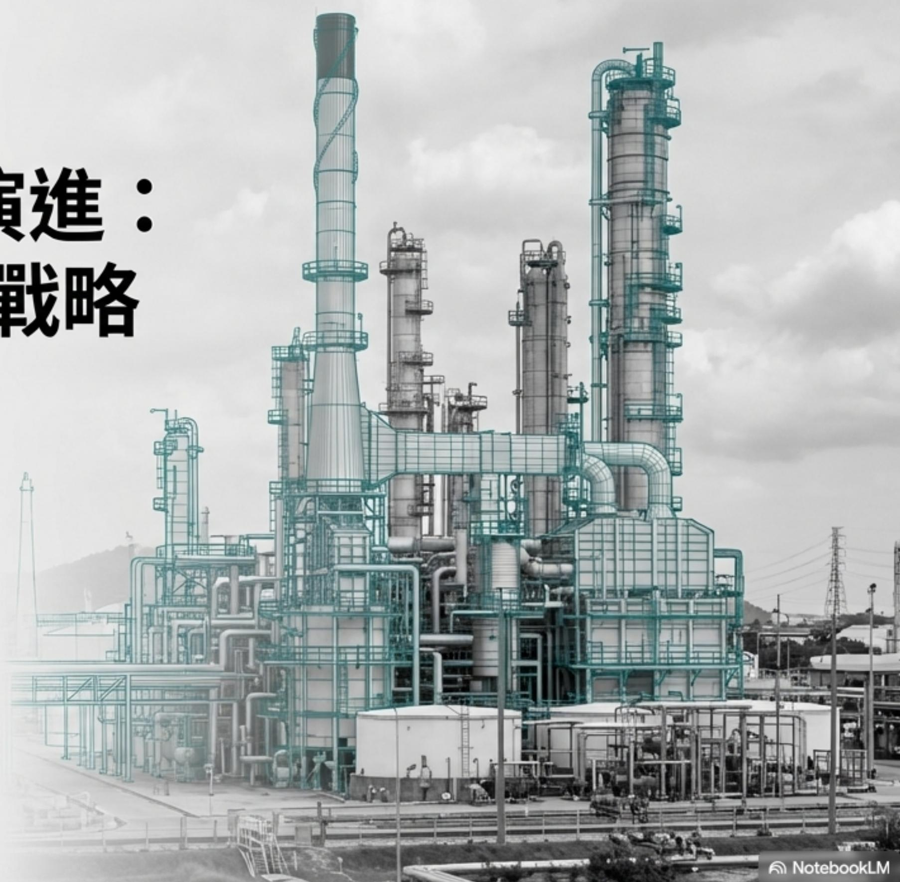
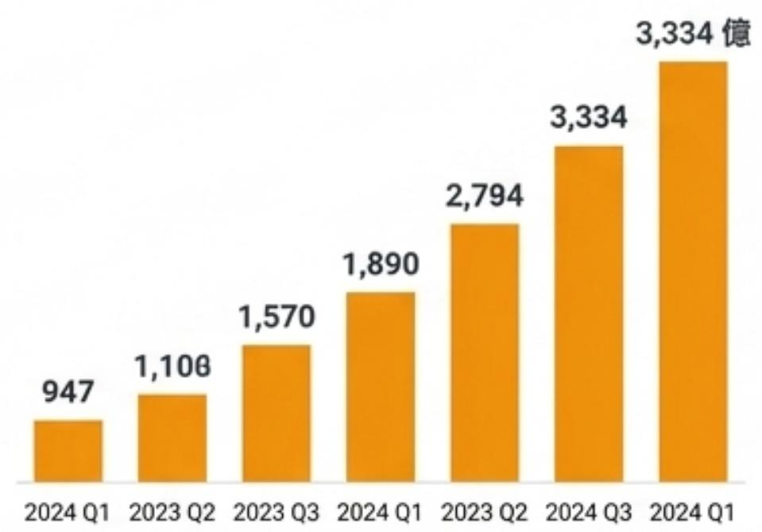
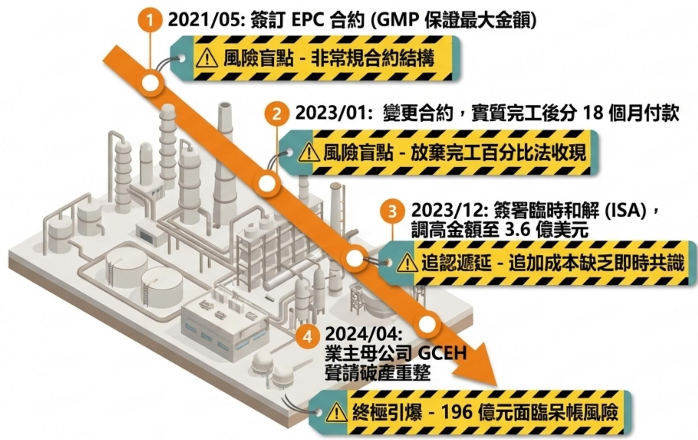
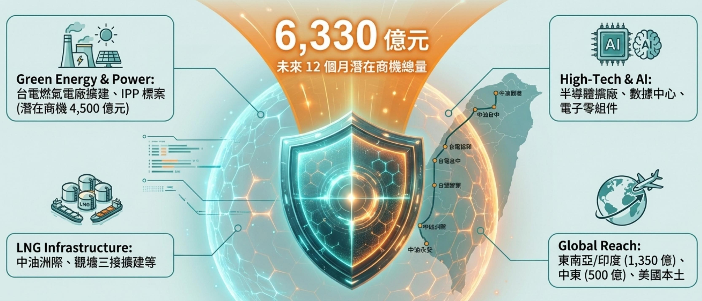
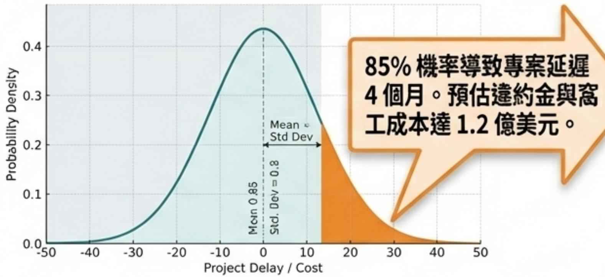

# 跨越千億規模的韌性演進次世代EPC數位防禦戰略

從196億的壓力測試，到守護6,330億潛在商機的「車規級」智慧工程藍圖

[PRESENTATION FOR]:  
中鼎集團(CTCI)董事會與高階決策核心  
[PREPARED BY]:  
林明彥(MY Lin)|跨界系統整合與戰略幕僚  
[CLASSIFICATION]:  
高階飘略機密(Confidential)

# 基業長青的底氣：全球百大工程的傲人版圖

# Global Ranking

126 / 59

ENR全球工程承包商第126名/國際工程承包商第59名

S&PGlobal   
CTCICorporation   
Gonstruction & Engineering   
Top 1%   
Corporate Susteinability   
Ascossment (CSA) 2024 Score   
8F/100 tren

標普永續年鑑(S&P Global)連三年Top $1 \%$ 最高榮譽

# Financial Power

3,334

  
新台幣在建工程 (2024Q1)

# Liquidity & Trust

現金與約當現金：279.04億元(資金充足，支應營無虞)

品

員工信託持股信心：3,500人中僅21人終止参與

# 壓力測試：解構美國BKRF196億元帳款危機

# 現況處置 (Current Status)

2024第一季認列31億元預期信用減損 (EPS -1.52)。

重整計畫生效：確保0.75億美元工程優先受償，並接手1年期O&M 服務。

戰略定調：錢沒有拿不回來，只是5年後售廠收回(引述董事長觀點)

# 危機背後的本質：傳統EPC風控機制的物理極限

# 傳統EPC管理盲區

# 次世代数位防禦需求

# 落後的财務防禦

高度依賴「完工百分比法」，遇特殊合約資金鍵瞬間失衡。

# 事前預防的數位生

在實體開工前，於虛擬世界完成所有設計衍衝突與成本超支壓力測試

事後追補的合約談判習慣「事後申請追加（Rework&Claim）」，爭議如滚雪球擴大。

# 動態風控儀表板

超越人為回報，建立數據驅動的即時止損機制 。

# 管理鞭長莫及

海外專案缺乏當地即時高精度監控，高層層無法第一時間攔截風險

# 車規級的容錯底線

導入「失效後維持運作 (Fail-Operational）」的極致安全精神‘

# 守護的價值：為何我們需要次世代「數位防護罩」？

關鍵洞察：面對高壓的AI擴建潮與複雜的海外法規，傳統「做一步算一步」的工程管理已成最大致命傷。我們必須升級防禦維度。

# 戰略典範轉移：將「車規級功能安全」植入EPC基因

汽车工业（Automotive) 統包工程(EPC Future)失效後維持運作 異常發生時的自動止損與動態優化(Fail-Operational) (Dynamic Mitigation)ISO 26262 IEC 61508(車規功能安全) (工程系統功能安全)降維轉譯HARA HAZOP/LOPA(危害分析與風險評估) (工程風險分析升級數位化)ASIL SIL (安全完整性等级)  
(汽車安全完整性等級A-D) 聯動高層決策警報機制核心概念：不是等撞車了才修車 (事後追認)而是在感測到危險前0.1秒自動介入煞車 (預測與止損) o

# 中鼎智慧工程大腦：D-R-A-P錯誤注入與時程預測流程

# 1. D (Digital Twin)数位学生與錯誤注入

匯入BIM模型與合約條款。主動注入「設備遲交」、「颶風停工」等一萬次失敗情境。

中鼎智慧工程大腦D-R-A-P流程透過數位攣生、風險壓力測試AI優化與即時回饋，主動預測與解決工程風險，實現超越傳統管理的預測性安全與效率提升。

MA

# 4. P (Predictive Feedback) 即時監控與回馈

現場AI影像聯動，若現實偏差達ASIL-D等級，警報直達執行長。

# 1. D (Digital Twin) _數位学生與錯误注入

匯入BIM模型與合約條款。主動注入「設備遲交」、「廳風停工」等一萬次失敗情境。

# 2. R (Risk & Stress Testing) 時程延宕壓力測試

運用自駕車動態路徑算法，精算「關鍵路徑(Critical Path)]偏移移量與連鎖反應成本。

# 3.A (AI Mitigation)自動化方案優化

Al自動生成Fail-Safe（備援替换）或DegradedMode(降級施工)方寨，並計算 ROI。

# 實戰推演：在虛擬世界失敗一萬次，換取實體世界的完美執行

# [Event Triggered]

美國德州長交期設備(壓力容器)供應商回報延遲12週。

# [Monte Carlo Risk Distribution Graph]

# [Al Generated Mitigation Strategies]

OptionA(Fail-Safe)-System Recommended

立即加價 $10 \%$ 啟動備選供應商。

成本：500萬美元丨预計挽回時程：8週

Option B(Degraded Mode)

變更現場工序，先行施作非受災區塊。

成本：0元|预计挽回時程：3週，維持當期估驗現金流

# 數位藍圖的操盤手：兼具「微觀技術」與「巨觀戰略」的戰略中樞

1.技術洞察與轉化(Tech to Market):從底層IC設計到高層系統架構的透視力姓名：林明彥(MY Lin)

學歷：台大機械工程碩士(專攻系統控制閉環邏輯)

戰略定位：企業外交官、跨界系統整合者、從0到1孵化器。

目標角色：集團數位戰略長(CDO)幕僚/技术特助。

5.國際談判與資本對接(IR &Negotiation) :對接國際投資者的品牌外交實力。

4.跨領域满通整合(Cross-domainintegration) :化解研發、業務與高層間的專業隔閏

2.風險與供應戰略(Risk & Supply  
Chain) :  
融合車規嚴苛標準與友達降價穩料  
實戰。

3.戰略規劃與孵化(0 to 1 Execution)統籌子公司設立的實體落地能力。

# 跨尺度整合實績：從精密晶片到巨型系統的遞進進化

# Level3:Macro(企業戰略與治理)亞瑟科技（Anax)總經理特助

驅動集園新事業體孵化，從商業計畫書到設立實體公司。將技術願景轉化為營收曲線與高層治理

# 董事長室的戰略延伸：建立極速反應的決策防護網

[Chairman&CEO]  
聚焦於6,330億商機的全球佈局與資本調度。  
不再被細碎的工地客訴與事後追加報告淹沒。  
[Digital Strategic CDO Office (MY Lin)]  
作為核心過滤器·行D-R-A-P引擎；只将 「ASIL-D等级  
（最高危險）」的變異與「附帶ROI的選擇題」上報。  
  
US EPC Projects Middle East EPC Projects Taiwan EPC Projects  
數據自動匯入，擺脫傳統層層掩飾的回報機制，實現穿透式管理。

# 在虛擬世界經歷一萬次壓力測試

# 在實體世界，成就完美執行。

邀請林明彥先生加入決策核心，共同將196億的震撼教育，轉化為守護中鼎未來千億霸業的最強數位防禦裝甲。

# CTCI